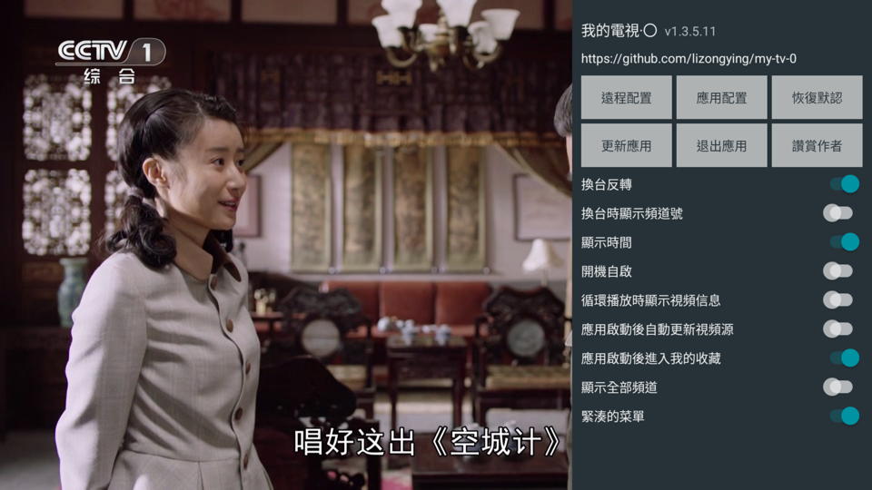
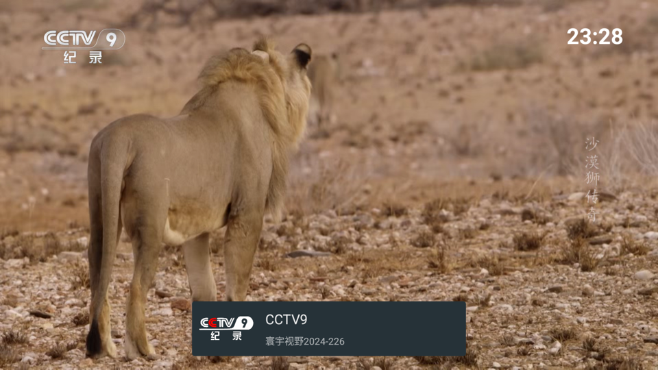

# 声明
## 关于播放源或者IPV6网络问题请自行搜索解决！
本项目仅为自用修改，仅在android4.4的夏普电视测试。

2026-05更新：
由于现在移动宽带赠送IPTV，很久没有需求使用这个APP了。但是总有需求老人没有IPTV，不懂更新软件源，需要装上后稳定能看一些台就好，稳定大于一切。此次更新主要将默认源配置为浙江/黑龙江/陕西的官方源，稳定能用不折腾。原作者项目也好一段时间没有维护，新代码测试后发现并不好用，因此此次未更新最新代码。

# 版本说明
* -kk ：支持android 4.4，自用版本，推荐
*  ~~-ijk ：支持android 4.4，播放器改成了ijkplayer，低端机器可能效果好些，自行测试~~  效果不理想，停止开发
* -jb ：支持andriod 4.2/4.3 ，未经测试，后续不维护

# 我的電視·〇

電視網絡視頻播放軟件，可以自定義視頻源

[my-tv-0](https://github.com/lizongying/my-tv-0)

## 使用

* 遙控器左鍵/觸屏單擊打開節目列表
* 遙控器右鍵/觸屏雙擊打開配置
* 遙控器返回鍵關閉節目列表/配置
* 打開配置頁后，選擇遠程配置，掃描二維碼可以配置視頻源地址等。
* 如果視頻源地址已配置，並且打開了“啟動后自動更新視頻源”后，軟件啟動后自動更新視頻源
* 在節目列表顯示的時候，右鍵收藏/取消收藏

注意：

* 視頻源可以設置為本地文件，格式如：file:///mnt/sdcard/tmp/channels.m3u
  /channels.m3u

目前支持的配置格式：

* txt
    ```
    組名,#genre#
    標題,視頻地址
    ```
* m3u
    ```
    #EXTM3U
    #EXTINF:-1 tvg-name="標準標題" tvg-logo="图标" group-title="組名",標題
    視頻地址
    ```
* json
    ```json
    [
      {
        "group": "組名",
        "logo": "图标",
        "name": "標準標題",
        "title": "標題",
        "uris": [
          "視頻地址"
        ],
        "headers": {
          "user-agent": ""
        }
      }
    ]
    ```

推薦配合使用 [my-tv-server](https://github.com/lizongying/my-tv-server)

下載安裝 [releases](https://github.com/lizongying/my-tv-0/releases/)

更多地址 [my-tv-0](https://lyrics.run/my-tv-0.html)





## 更新日誌

[更新日誌](./HISTORY.md)

## 其他

建議通過ADB進行安裝：

```shell
adb install my-tv-0.apk
```

小米電視可以使用小米電視助手進行安裝

## TODO

* 視頻解碼
* 支持回看
* 詳細EPG
* 淺色菜單
* 無效的頻道？
* 判断文件是否被修改
* 多源管理
* 如果上次播放頻道不在收藏？
* 當list為空，顯示group
* 默認頻道菜單顯示

## 讚賞


## 感謝

[live](https://github.com/fanmingming/live)

[](https://dartnode.com "Powered by DartNode - Free VPS for Open Source")
